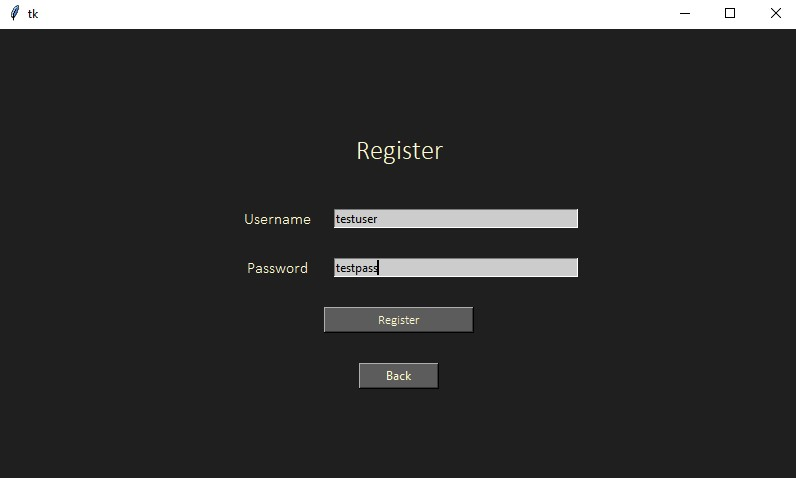

Password-Manager 
By
1811027 Neeraj Naik
1811033 Vatsal Pathak
18811035 Tarush Rajput

* Quick Introduction :

Password-Manager encrypts (AES encryption) and stores all your credentials in firebase firestore. passwordmanager.py contains the frontend of the code which uses tkinter and passman.py contains the backend of the code which demonstrates the connectivity with firebase. The executable file is in the exe folder.

* Password-Manager :

In today’s world, almost all platforms require their users to login their account. Credentials are required. We can either use same credentials for all platforms or create a unique password for each one of them. Using same credentials is a risky step. Even if any one of the platform’s database gets breached, the user is at risk of exposing their credentials of a lot of platforms. Another approach is to have different credentials for all platforms. Now this will require them to remember all of them, which is not a comfortable approach. We can keep the passwords stored, but that is not a safe approach since anyone who gets access to that gets complete access to all information. So, both the scenarios lead to same result.
Password-Manager software assists users to save their credentials safely, to use them to login whenever required. It aims to build a hassle-free solution to the problem of remembering different passwords to different accounts on different platforms. Password-Manager also ensures privacy to its users. The protection of the passwords is protected by using cryptography which hashes the passwords allowing full privacy and security to the user. All the stored passwords are encrypted using AES encryption. The only thing that users need to remember is just the credentials to the Password-Manager software. Also as an additional feature, we have added a password generator for suggesting passwords as per their lengths and the type of strength the user demands.

* Technologies :

1) Python: The software is developed in python language.
Python is an advantageous programming language for cybersecurity because it can perform many cybersecurity functions, including malware analysis, scanning, and penetration testing functions. It is user-friendly and has an elegant simplicity, making it the perfect language choice for many cybersecurity professionals.  Python has been at the forefront for many years. It is a general-purpose, server-side scripting language that has been used for thousands of security projects. 

2) Tkinter: The User interface for the application is built using Tkinter technology in python.
Python has a lot of GUI frameworks, but Tkinter is the only framework that’s built into the Python standard library. Tkinter has several strengths. It’s cross-platform, so the same code works on Windows, macOS, and Linux. Visual elements are rendered using native operating system elements, so applications built with Tkinter look like they belong on the platform where they’re run.
Tkinter is lightweight and relatively painless to use compared to other frameworks. This makes it a compelling choice for building GUI applications in Python, especially for applications where a modern sheen is unnecessary, and the top priority is to build something that’s functional and cross-platform quickly.

3) Firebase technology: The database used for securely storing the encrypted credentials is Firebase backend cloud storage

Firebase manages all data real-time in the database. So, the exchange of data to and fro from the database is easy and quick. Hence, if you are looking to develop mobile apps such as live streaming, chat messaging, etc., you can use Firebase. Firebase allow syncing the real-time data across all the devices- Android, iOS, and the web without refreshing the screen. Everything from databases, analytics to crashing reports are included in Firebase. So, the app development teams can stay focused on improving the user experience

4) The encryption technique used here is AES encryption.
AES Encryption stands for Advanced Encryption Standard (also known as Rijndael) and follows a symmetric encryption algorithm, i.e., the same key is used to encrypt and decrypt the data. AES supports block lengths of 128, 192 and 256 bits.
The following characteristics make AES encryption extremely software and hardware friendly:
* Immune to all known attacks
* Speed and compatibility of source code on various computing platforms
* Simplicity of design
AES encryption is the gold standard of encryption. Period. You see it with messaging apps like WhatsApp, organizations dealing with highly sensitive data like NASA, tech giants like Microsoft and numerous small businesses around the world.

*  Features:

1) GUI – The GUI of this app is very simple to use, it does not open a new window on pressing a button, instead the code is written in such a way that the frames are stacked on top of each other and the desired frame is shown to the user 
2) User Login – The app allows multiple user login. So we built a login page for allowing existing users to login. The information i.e. the username and password. Once the user enters his/her credentials, the database checks the validity of the user and if the details match, it allows the user to log into the application, else if not, it gives an invalid prompt.
3) User Signup – The app allows the user to create new accounts to store their username and password. The information gets stored in the database and the application redirects us to the login page. From there we can login and reach the main page
4) Password Manager – This is the main page of the project. The left side of the page contains the information. It is a scrollable text box which has the name of the website. The username and the password for the user is displayed just below the name of the website On the right side of the page is another frame in which the user has the option to enter an new website name along with the username and password for the given site.
5)  Password Generator – This page has a random password generator. There is one field to select the length of the password you required. Also another option is given through radio buttons to decide the strength of the password required. i.e. weak, medium and strong.

*  Additional  libraries used :

Firebase-admin- For registering the user and storing the user into a database, we use firebase. The usernames and the encrypted passwords for the users is stored in this as well.

Cryptodomex – To encrypt the passwords of the user so that they are not visible in standard for to the viewer of the database.

The user manual, which contains instructions to use the software and shows execution details is also uploaded. requirements.txt lists all the requirements to run the software.

