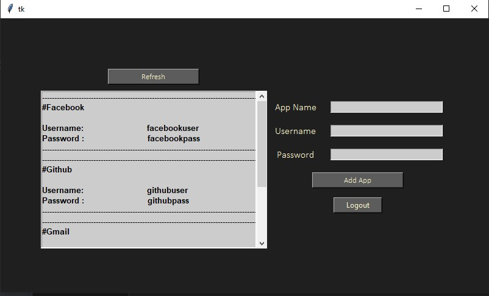

# Password-Manager
Encrypts(AES encryption) and stores all your credentials in firebase firestore. passwordmanager.py contains the frontend of the code which uses tkinter and passman.py contains the backend of the code which demonstrates the connectivity with firebase

